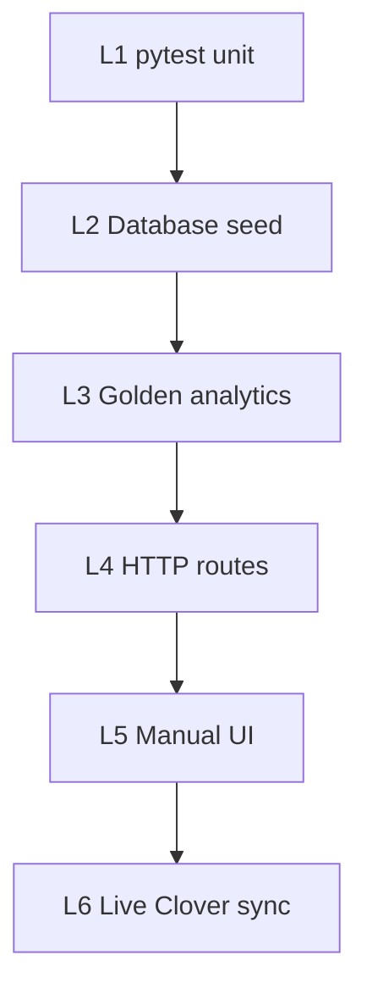

# Verification runbook

End-to-end checks for MicroMarketResearch analytics, ETL, and UI.

**Testing standards (reversible / no data damage / no unnecessary API pulls):** [TESTING_STANDARDS.md](TESTING_STANDARDS.md)

## Flow overview



## Layer 1 — Unit and integration tests (safe default)

```powershell
cd MicroMarketResearch
.\.venv\Scripts\Activate.ps1
pytest -v
```

**Pass:** all tests green (includes transform, margins, shrinkage, routes, dashboards, seasonal, golden).

**Guarantees:** does not modify `analytics.db`, `.env`, or call Clover. See [TESTING_STANDARDS.md](TESTING_STANDARDS.md).

## Layer 2 — Database and demo data

```powershell
python scripts/init_db.py
python scripts/seed_demo_data.py
```

**Pass:** script prints row counts; opening `/dashboards/sales` shows non-zero KPIs after `python run.py`.

**Live Clover (optional):**

```powershell
python scripts/check_clover_connection.py
python scripts/run_clover_api_battery.py
python scripts/seed_sandbox.py --days 90 --mode full
```

**Pass:** single-item smoke OK; battery **7/7**; PII audit passes; `sync_log.status = success`. See [TESTING_STANDARDS.md](TESTING_STANDARDS.md) for battery details and JSON reports.

## Layer 3 — Golden analytics fixtures

```powershell
pytest tests/test_analytics_golden.py tests/test_seasonal.py -v
```

**Pass:** KPI totals match [`tests/fixtures/golden_demo_expectations.json`](../tests/fixtures/golden_demo_expectations.json) for a fixed “today” and seeded demo DB.

## Layer 4 — HTTP smoke

```powershell
pytest tests/test_routes.py tests/test_dashboards.py -v
```

**Pass:** `/`, `/dashboards/*`, `/analysis/*`, `/item/<id>`, `/settings` return 200 (404 only for unknown items).

## Layer 5 — Manual UI checklist

1. Start app: `python run.py` → http://127.0.0.1:5000/dashboards/sales
2. **Period filters:** try 7d, 30d, 90d, Semester, Prior week on Sales / Inventory / Profit.
3. **Insights:** `/analysis/insights` — day-of-week chart, WoW KPI, reorder table, event comparison dropdown.
4. **Sync Now:** modal shows all stages → done; page refresh updates KPIs (with valid Clover creds).
5. **Item drill-down:** click a product name → chart and margin tiles load.
6. **CSV:** download buttons on Sales, Profit, Inventory, Insights reorder export.
7. **Settings:** save merchant ID; add/delete academic calendar event; confirm Insights reflects DB events.
8. **Reports:** Margins, Shrinkage (needs 2+ syncs for snapshots), Velocity.

## Layer 5b — UX variant smoke

```powershell
pytest tests/test_ux_variants.py tests/test_ux_variant_cookie.py -v
```

Manual: cycle all four **UI demo preset** values in the sidebar; confirm nav and period chips match [UX_OPTIONS.md](UX_OPTIONS.md).

**Data freshness:** sidebar shows last sync time; after Sync Now + page reload, KPIs change. With `AUTO_SYNC_INTERVAL_MINUTES=0` (default), data does not change until sync or reload.

## Layer 6 — Production Clover

1. `.env`: `CLOVER_API_TOKEN`, `CLOVER_MERCHANT_ID`, `CLOVER_BASE_URL=https://api.clover.com`
2. `INGEST_LOOKBACK_DAYS=90` (or higher for semester trends)
3. Settings → Production URL → Save → Sync Now
4. Confirm `sync_log` latest row is `success` and Insights forecast/reorder tables populate.

## Troubleshooting

| Symptom | Check |
|---------|--------|
| 401 on sync | Token matches environment (production vs sandbox) |
| Empty dashboards | Run `seed_demo_data.py` or successful sync |
| Shrinkage empty | At least two stock snapshots over the lookback window |
| Semester range wrong | `SEMESTER_START_DATE` in `.env` or `config/academic_calendar.json` |
| Golden tests fail | Do not change demo seed totals without updating fixture JSON |

## Regenerating golden expectations

After intentional changes to `seed_demo_data.py`:

```powershell
pytest tests/test_analytics_golden.py -v
# Update tests/fixtures/golden_demo_expectations.json if assertions were deliberate
```
